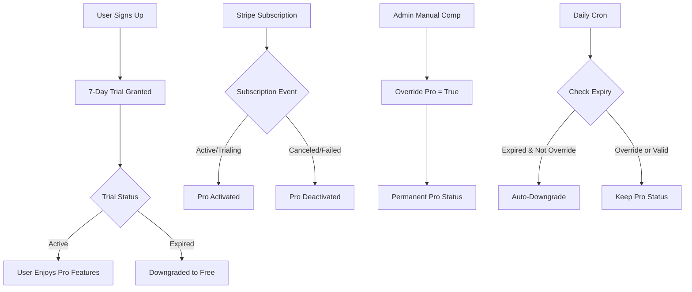

# Enhanced Pro Status System

## Overview
Robust Pro-status handling system that supports:
- **Automatic 7-day trials** for every new sign-up
- **Stripe subscription sync** (activate/deactivate)  
- **Manual comps** that never get overwritten by Stripe or trial expiry
- **Safety-net cron job** for orphaned trials

## Pro Status Lifecycle



## Database Schema

```sql
public.pro_status (
  id                uuid primary key,         -- = auth.users.id
  is_pro            boolean default false,
  pro_expires_at    timestamptz,             -- nullable for permanent Pro
  stripe_customer_id text unique,            -- nullable, links to Stripe
  override_pro      boolean default false,   -- manual comp flag
  notes             text,                    -- optional admin notes
  created_at        timestamptz default now(),
  updated_at        timestamptz default now()
)
```

## Core Functions

### A. 7-Day Trial System
**Trigger**: `trg_grant_initial_pro` on `auth.users` AFTER INSERT
```sql
-- Idempotent trial grant
INSERT INTO public.pro_status (id, is_pro, pro_expires_at)
VALUES (user_id, true, now() + interval '7 days')
ON CONFLICT (id) DO NOTHING;
```

### B. Stripe Integration
**Webhook**: `supabase/functions/handle-stripe-webhook/index.ts`

| Stripe Status | Action | Database Update |
|--------------|--------|----------------|
| `active`, `trialing` | Enable Pro | `is_pro = TRUE`, `pro_expires_at = current_period_end` |
| `canceled`, `unpaid`, `past_due`, `incomplete_expired` | Disable Pro | `is_pro = FALSE`, `pro_expires_at = now()` |

**Important**: Only updates records where `override_pro = FALSE`

### C. Daily Safety Net
**Cron**: `expire_pro_trials_daily` at 04:00 UTC
```sql
UPDATE public.pro_status 
SET is_pro = false, updated_at = now()
WHERE is_pro = true 
  AND pro_expires_at < now() 
  AND override_pro = false;
```

### D. Manual Comp Workflow
```sql
-- Grant permanent manual comp
UPDATE public.pro_status
SET is_pro = true,
    override_pro = true,
    pro_expires_at = null,
    notes = 'Comped by admin on 2025-07-25'
WHERE id = '<user-uuid>';
```

**Protection**: Manual comps are **never** modified by Stripe webhooks or cron jobs.

## Effective Pro Status Logic

A user has **effective Pro status** when:
```sql
is_pro = TRUE AND (
  override_pro = TRUE OR                    -- Manual comp
  pro_expires_at IS NULL OR                 -- Permanent Pro
  pro_expires_at > now()                    -- Active subscription/trial
)
```

## Implementation Files

### Database
- `supabase/migrations/20250725024908_enhanced_pro_status.sql` - Complete schema and functions

### Backend
- `supabase/functions/handle-stripe-webhook/index.ts` - Stripe webhook handler with signature verification

### Frontend
- `src/hooks/useProStatus.ts` - React hook for Pro status management
- `src/types/dashboard.ts` - Enhanced TypeScript interfaces

### Tests
- `tests/enhanced_pro_status.spec.ts` - Comprehensive unit tests for all flows

### Marketing Updates
- `src/components/marketing/Hero.tsx` - CTA → `/signup`
- `src/components/marketing/Nav.tsx` - CTA → `/signup` (desktop + mobile)  
- `src/components/marketing/FooterCTA.tsx` - CTA → `/signup`

## Development Workflows

### Reset User Trial
```sql
DELETE FROM public.pro_status WHERE id = '<user-uuid>';
-- Then create new user or manually trigger grant_initial_pro()
```

### Grant Manual Comp
```sql
UPDATE public.pro_status
SET is_pro = true,
    override_pro = true,
    pro_expires_at = null,
    notes = 'Manual comp - [reason]'
WHERE id = '<user-uuid>';
```

### Test Stripe Webhook Locally
```bash
# Using Stripe CLI
stripe listen --forward-to localhost:54321/functions/v1/handle-stripe-webhook
stripe trigger customer.subscription.created
```

### Test Trial Expiration
```sql
-- Fast-forward a trial
UPDATE public.pro_status 
SET pro_expires_at = now() - interval '1 day'
WHERE id = '<user-uuid>';

-- Run expiration manually
SELECT public.expire_orphan_pro();
```

## Security Features

### Webhook Security
- **Signature Verification**: Uses Web Crypto API to verify Stripe webhook signatures
- **Environment Variables**: `STRIPE_WEBHOOK_SECRET` for signature validation

### Database Security
- **RLS Policies**: Users can only view their own Pro status
- **Service Role**: Only service role can modify Pro status (via functions)
- **Manual Comp Protection**: `override_pro` flag prevents automated modifications

### Error Handling
- **Idempotent Operations**: Trial grants and webhook updates handle duplicates gracefully
- **Graceful Degradation**: Frontend defaults to Free status on errors
- **Comprehensive Logging**: All webhook events and database operations are logged

## Monitoring & Observability

### Key Metrics
- **Trial Conversion Rate**: Users who subscribe after trial
- **Manual Comp Usage**: Frequency of admin overrides
- **Webhook Success Rate**: Stripe integration reliability
- **Cron Job Execution**: Daily expiration job health

### Alerting
- **Failed Webhooks**: Monitor for Stripe signature verification failures
- **Orphaned Trials**: Users with expired trials not caught by cron
- **Manual Comp Conflicts**: Attempts to modify override_pro users via automation

## Testing Strategy

### Unit Tests (Vitest)
- ✅ Trial flow (grant, expire, idempotency)
- ✅ Stripe integration (activate, deactivate, respect overrides)
- ✅ Manual comp protection (cron and Stripe immunity)
- ✅ Effective Pro status logic (all edge cases)

### Integration Tests
- Webhook signature verification
- Database function execution
- RLS policy enforcement

### E2E Tests (Optional - Playwright)
- Sign up → Pro trial badge appears
- Stripe checkout → Pro status persists
- Customer portal cancellation → Pro status disappears

## Deployment Checklist

- [ ] **Apply Migration**: `supabase db push`
- [ ] **Deploy Edge Function**: `supabase functions deploy handle-stripe-webhook`
- [ ] **Configure Webhook**: Add endpoint URL to Stripe dashboard
- [ ] **Set Environment Variables**: `STRIPE_WEBHOOK_SECRET`
- [ ] **Test Webhook**: Create test subscription and verify database updates
- [ ] **Verify Cron**: Check `pg_cron` extension and job scheduling
- [ ] **Run Tests**: `npm run test tests/enhanced_pro_status.spec.ts`

## Troubleshooting

### Common Issues

**Webhook 400 Errors**
- Check `STRIPE_WEBHOOK_SECRET` environment variable
- Verify webhook endpoint URL in Stripe dashboard
- Ensure signature verification logic matches Stripe's requirements

**Manual Comps Being Overwritten**
- Verify `override_pro = true` in database
- Check Stripe webhook logic respects override flag
- Ensure cron job excludes `override_pro` records

**Trial Not Granted on Signup**
- Verify trigger `trg_grant_initial_pro` exists and is enabled
- Check `auth.users` insert permissions
- Look for database trigger execution errors in logs